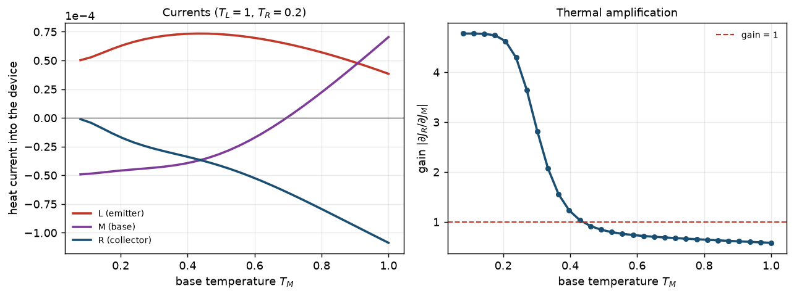
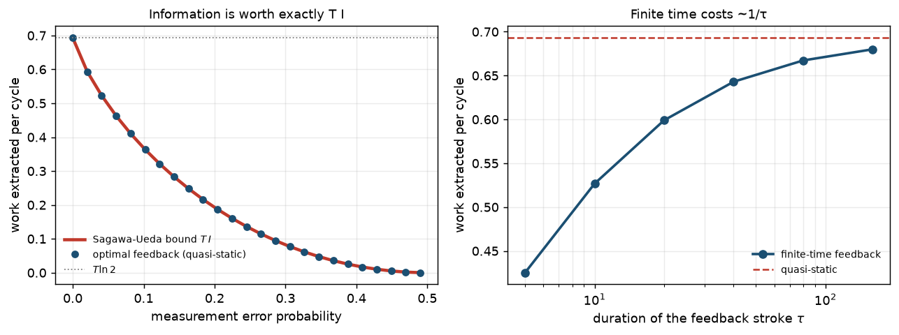

# qthermo

Thermodynamic bookkeeping for open quantum systems — heat, work, entropy
production, currents and their fluctuations — with the modelling traps checked
for you.

You write down a Hamiltonian and the baths. `qthermo` gives you per-bath heat
currents, entropy production, efficiencies against their Carnot bounds,
site-resolved energy flows, exact current fluctuations and uncertainty-relation
ratios, for stroke machines and continuous machines, from one qubit to a few
hundred levels. It also tells you when the model you wrote down cannot mean
what you think it means.

```bash
pip install "qthermo[plot] @ git+https://github.com/VivekKhanna0/Qthermo"   # numpy, scipy, matplotlib
python -m qthermo.benchmarks      # 41 checks against published results, ~40 s
```

or, to run the examples and tests, `git clone` the repository and
`pip install -e ".[dev]"`.

**Highlights**, each reproduced by the package and checked in CI:

- Local master equations can make heat flow from cold to hot. `qthermo`
  detects it and runs the same machine under global baths in one call.
- The three-qubit absorption fridge hits COP = ω_c/ω_h to 1e-15, and its
  target qubit transiently cools *below* its steady state.
- The coherently driven maser beats the classical thermodynamic uncertainty
  relation (exact current noise, no sampling).
- Optimal finite-time protocols for *any* drive: simulations land on the
  predicted minimum L²/τ to 0.2%.
- A quantum Szilard engine attains the Sagawa–Ueda bound exactly, and a
  zz-coupled transistor amplifies heat currents 4.8×.
- Agrees with QuTiP to 1e-16 (steady states) and 1e-10 (dynamics).

**New here?** [`examples/tutorial.ipynb`](examples/tutorial.ipynb) takes one
research question (a two-qubit thermal diode) from a Hamiltonian to publishable
numbers, including the checks a referee would ask about. It renders on GitHub
with all outputs.

**Docs:** [physics definitions](docs/physics.md) · [API reference](docs/api.md) ·
[figure gallery](docs/gallery.md) · [examples](examples/README.md) ·
[changelog](CHANGELOG.md)

## Thirty seconds

```python
import qthermo as qt

fridge = qt.models.absorption_refrigerator(T_c=1.0, T_h=6.0, T_r=1.5)
steady = fridge.analyze()
print(steady.report())
```
```
bath                  T   J (into system)          -J/T
-------------------------------------------------------
cold                  1      6.963227e-04   -6.9632e-04
hot                   6      2.088968e-03   -3.4816e-04
room                1.5     -2.785291e-03    1.8569e-03
-------------------------------------------------------
sum                             1.301e-18    8.1238e-04
entropy production rate: 8.1238e-04
note: local baths -- valid only for inter-site coupling << bath rates; compare with global baths
```
```python
steady.cop("cold", "hot")                                  # 0.3333 = w_c / w_h exactly
steady.absorption_carnot_cop("cold", "hot", "room")        # 1.5
print(fridge.compare().report())       # would "you used a local master equation" change anything?
```
```
bath                 J local      J global   rel. diff
------------------------------------------------------
cold             6.96323e-04   7.53796e-04       7.62%
hot              2.08897e-03   2.27304e-03       8.10%
room            -2.78529e-03  -3.02684e-03       7.98%
------------------------------------------------------
entropy production rate: local 8.1238e-04, global 8.8526e-04
steady-state trace distance: 1.040e-02
```
```python
qt.plot_machine(steady)      # the figure below
```


Baths (squares) and qubits (circles) share one temperature colour scale; each
qubit is coloured by its **virtual temperature**. The cold qubit is colder
than every bath, which nothing passive can do. Arrow widths are heat
currents, and the internal balances close to ~1e-17.

## Your own model

Nothing above is special-cased. Describe the sites, the couplings and which
bath touches which site:

```python
machine = qt.build_model(
    local_H=[qt.qubit_hamiltonian(1.0), qt.qubit_hamiltonian(0.6)],
    interactions={(0, 1): (0.3 * qt.sigma_x, qt.sigma_x)},          # 0.3 sx (x) sx
    baths=[dict(name="hot", site=0, coupling=qt.sigma_x, T=2.0, gamma=0.1),
           dict(name="cold", site=1, coupling=qt.sigma_x, T=1.0, gamma=0.1)],
    master_equation="global")

steady = machine.analyze()                          # exact steady state, per-bath currents
print(qt.audit(machine))                            # every consistency check
machine.compare()                                   # the same machine under local baths
qt.current_statistics(machine, "hot")               # exact noise, TUR / KUR ratios
qt.plot_machine(steady)                             # heat-flow network, virtual temperatures
qt.report(machine, "machine.html")                  # all of it in one shareable page
```

Sites can have any dimension, and interactions can be given as full matrices.
For full control, build the baths yourself:
`qt.davies_bath(H, coupling, T)` gives the *global* (secular,
detailed-balance) bath for any Hamiltonian, coupled, degenerate or many-body,
and `qt.local_bath` gives the local one. `qt.analyze(H, baths)` takes any list
of them. QuTiP `Qobj`s are accepted anywhere an array is.

## I want to...

| ...do this | call |
|---|---|
| get currents, entropy production, COP/efficiency of a continuous machine | `qt.analyze(H, baths)` or `model.analyze()` |
| check my model for known modelling mistakes | `qt.audit(model)` or `qt.audit(H, baths)` |
| describe my own machine once and get every tool | `qt.build_model(local_H, interactions, baths)` |
| build baths for a coupled / many-body system | `qt.davies_bath` (global), `qt.local_bath` (local) |
| know whether local vs global master equations matter | `model.compare()` |
| see where heat flows inside a multi-qubit machine | `qt.heat_flow_map(steady)`, `qt.plot_machine(steady)` |
| follow each qubit (energy, T*, entanglement) through a cycle | `qt.site_dynamics(result, dims, local_H)`, `qt.plot_site_dynamics` |
| get the noise of a current and the TUR/KUR ratios | `qt.current_statistics(model, "bath")` |
| simulate a stroke cycle and its limit cycle | `qt.Cycle([qt.Stroke(...), ...]).limit_cycle(rho0)` |
| know the quasi-static limit of an interacting Otto engine | `qt.ideal_otto(H_c, H_h, T_c, T_h)` |
| get the exact heat distribution of one cycle | `qt.cycle_counting(cycle, {"stroke": "quanta"})` |
| map engine / fridge / heater / accelerator regions | `qt.mode_map(build, xs, ys)`, `qt.plot_mode_map` |
| scan any machine over parameters | `qt.sweep`, `qt.scan_2d`, `qt.pareto_front` |
| go beyond weak coupling | `qt.reaction_coordinate_model`, `qt.rc_convergence` |
| cost of erasure and the optimal protocol | `qt.landauer_erasure`, `qt.geodesic_schedule` |
| work from information (measurement + feedback) | `qt.szilard_engine(T, error=..., tau=...)` |
| the least-dissipative schedule for *my* drive | `qt.optimal_schedule(H_of, baths_of, T, path)` |
| a machine powered by a periodic drive | `qt.floquet_analyze(H_of_t, period, [qt.DrivenBath(...)])` |
| what happens after switching a machine on | `qt.transient(model, rho0, duration)` |
| conductance matrix, Onsager check, transistor gain | `qt.response(build, {bath: T})` |
| analyse a quantum battery | `qt.batteries.ergotropy_split`, `locked_ergotropy`, `dicke_battery` |
| use lab numbers (GHz, mK, µs, W) | `lab = qt.LabUnits(5.0)`; `lab.temperature(20)`, `lab.rate(1/T1)`, `lab.to_watts(J)` |
| save results with provenance | `qt.save(result, "file.json")` |
| send a colleague the result *and* the checks | `qt.report(model, "machine.html")`, a single self-contained page |
| an interactive page with a parameter slider | `qt.explorer(build, values, path="x.html")` |
| confirm the package is right | `python -m qthermo.benchmarks` |

## What it catches

Most of the value is here. Each of these is a mistake that produces a plausible
number with no error message, and each is detected and explained. `qt.audit`
runs every check in one call:

```python
print(qt.audit(qt.models.two_qubit_heat_valve(master_equation="local")))
```
```
[ERROR] local vs global: the two master equations disagree on the direction of heat flow for hot, cold
          Inter-site coupling is too strong for the local approximation. Use the
          global model.
[info]  relaxation time: 2.72 (populations)
[ok]    steady state: unique
[ok]    second law: entropy production rate 1.937e-02 >= 0
[ok]    internal currents: site energy balances close to 3.5e-17
[ok]    uncertainty relation: 'hot': TUR ratio 9.626 >= 2
[ok]    uncertainty relation: 'cold': TUR ratio 5.117 >= 2
------------------------------------------------------------
1 error(s), 0 warning(s), 6 other checks
```

| Trap | What happens | What `qthermo` does |
|---|---|---|
| Local master equation on coupled sites | Heat can flow cold → hot; σ < 0 (Levy & Kosloff 2014) | Warns on σ < 0; `model.compare()` runs local vs global side by side; bare-Hamiltonian accounting with explicit boundary work (De Chiara et al. 2018) |
| Non-unique steady state | Identical qubits on one bath, dark states, conserved quantities: "the" steady state doesn't exist | Detected from the conditioning of the linear solve; raises unless you give an initial state, then returns the state it actually relaxes to |
| Baths that respect a symmetry of H | e.g. σx couplings on an Ising medium conserve parity; isochores never thermalise and the "efficiency" describes a different machine | `otto_cycle` refuses and says which symmetry-breaking coupling to use |
| Level crossings in an interacting Otto engine | Energy-rank pairing of levels gives the wrong quasi-static cycle | `ideal_otto` follows adiabatic continuation along the actual drive |
| Degenerate levels + flat spectral density | The zero-frequency channel has an undefined rate; thermalisation silently takes 1000× longer | Warns; `relaxation_time()` exposes the time scale; `otto_cycle` checks τ_iso against it |
| Global ME and local currents | The secular steady state is diagonal in H, so every bond current i⟨[V,h_i]⟩ is identically zero | `heat_flow_map` says so instead of printing zeros |
| Reaction-coordinate truncation | Strong coupling displaces the RC; too few levels gives unconverged currents | `rc_convergence()` reports the change between truncations |
| Temperature inconsistent with the channel | σ < 0 from a mislabelled bath | Warning naming the likely cause |
| Bath temperature inconsistent with its rates | A bath labelled T=2 whose jump rates encode T=3 gives a meaningless σ | `audit` infers the detailed-balance temperature from the jump operators and compares |
| Invalid input | Non-Hermitian H, unnormalised ρ, wrong dimensions | `QThermoError` naming the violated requirement, never a LinAlg traceback |

## What it does

| Area | Entry points | Validated against |
|---|---|---|
| **Stroke machines** (Otto, arbitrary cycles) | `Stroke`, `Cycle`, `limit_cycle` | Otto COP/efficiency limits; first law to 1e-16 by construction |
| **Interacting working media** | `ideal_otto`, `otto_cycle`, `resolve_stroke` | Exact quasi-static limit (simulation agrees to 1e-8); coupling-enhanced efficiency (Thomas & Johal 2011) |
| **Continuous machines** | `analyze`, `steady_state`, `models.*` | LPS fridge COP = ω_c/ω_h exactly; SSDB maser η = 1 − ω_c/ω_h; Carnot bounds |
| **Bath models** | `davies_bath`, `local_bath`, `instantaneous_bath` | Gibbs fixed point for random H to 1e-16; Levy–Kosloff violation reproduced and resolved |
| **Where the heat goes** | `heat_flow_map`, `plot_machine`, virtual temperatures, concurrence, negativity | Site balances close to 1e-17; Werner-state entanglement threshold |
| **Fluctuations** | `current_statistics`, `scaled_cgf` | Exact vs tilted-generator vs independent classical FCS (1e-10); Gallavotti–Cohen symmetry to 1e-15; TUR holds for all classical machines, violated by the maser as published |
| **Strong coupling** | `reaction_coordinate_model`, `mean_force_state` | O(λ²) weak-coupling limit; Cresser–Anders ultrastrong limit; heat-current turnover |
| **Information** | `landauer_erasure`, `geodesic_schedule`, `thermodynamic_length`, `szilard_engine` | Erasure → T ln 2; excess ∝ 1/τ matching slow-driving theory to <1%; geodesic attains L²/τ. Szilard engine attains the Sagawa–Ueda bound T·I exactly, including with measurement errors |
| **Periodically driven machines** | `floquet_analyze`, `DrivenBath`, `window_spectrum` | Undriven limit = static Davies (1e-14); Bessel sideband weights; tight-coupling efficiency and COP of the modulated-qubit machine to 1e-7; σ ≥ 0 for random drives |
| **Linear response** | `response` → conductance, Onsager matrix, coupling `q`, `amplification` | Onsager reciprocity to 1e-9; tight coupling \|q\| = 1 for the local fridge; thermal-transistor gain 4.8 |
| **Transients** | `transient`, `product_thermal_state` | Long-time limit = steady state; cumulative heat balances ΔE; single-shot cooling below steady state |
| **Optimal protocols** (any H(λ), any thermalising bath) | `friction`, `optimal_schedule`, `excess_work` | Friction metric reproduces the erasure closed form to 1e-11; non-commuting drive: simulated excess within 0.2% of L²/τ, 34% below a linear ramp |
| **Quantum batteries** | `batteries.ergotropy_split`, `locked_ergotropy`, `asymptotic_ergotropy`, `dicke_battery`, `collective_advantage` | Dicke √N power advantage (exponent 0.499); locked ergotropy of a Bell pair; activation of passive states |
| **Per-cycle statistics** | `cycle_counting` (exact), `unravel` (sampled) | Exact P(n) vs independent classical telegraph model (1e-12); vs trajectories; Jarzynski to 1e-16 |
| **Operation modes** | `classify`, `mode_map`, `plot_mode_map`, `.mode()` on every result | Quasi-static qubit Otto boundary ω_c/ω_h = T_c/T_h reproduced exactly |
| **Optimisation** | `sweep`, `scan_2d`, `pareto_front` (cycles *and* continuous models) | Interior optimum located; sequential vs joint tuning |

## Figures

<table>
<tr>
<td width="50%"></td>
<td width="50%"></td>
</tr>
<tr>
<td><b>When the local master equation breaks.</b> Past g ≈ 0.55 it moves heat
from cold to hot. The global model never does.</td>
<td><b>Beyond any classical machine.</b> The maser's power output is more
precise than the thermodynamic uncertainty relation allows a classical
process. Computed exactly, with no sampling.</td>
</tr>
<tr>
<td width="50%"></td>
<td width="50%"></td>
</tr>
<tr>
<td><b>A quantum thermal transistor.</b> The base heat current steers up to
4.8× as much collector current. The conductance matrix is checked for Onsager
symmetry.</td>
<td><b>Information into work.</b> Optimal feedback attains the Sagawa–Ueda
bound T·I exactly, even with measurement errors. In finite time it falls
short by ~1/τ.</td>
</tr>
</table>

**[The full gallery: 16 figures, with what each shows →](docs/gallery.md)**, covering
strong coupling, Landauer erasure, optimal protocols, interacting Otto
engines, entanglement inside a two-qubit engine cycle, operation-mode maps,
periodically driven machines, transient cooling, transport scaling and
quantum batteries.

## Verification

```bash
python -m qthermo.benchmarks     # computed value next to the published / analytic one
python -m pytest                 # ~235 tests, ~90 s
```

Every benchmark is a number fixed independently of this code: a closed-form
limit, an exact identity, or a published bound or violation. A failure means
the physics is wrong, not that an interface changed. The test suite adds
randomised property tests. They draw random Hamiltonians, couplings, baths and
temperatures (qubits, qutrits, mixed dimensions, degenerate spectra) and
assert what must always hold:

- the steady state is a valid, stationary density matrix;
- energy is conserved and σ ≥ 0;
- a single bath gives the Gibbs state;
- counting statistics reproduce the currents;
- site flows close;
- ergotropy is non-negative and zero for passive states.

It is also cross-checked against QuTiP. CI runs all of this, and every
example, on every push.

```
[continuous machines]
ok  3-qubit absorption fridge COP (local ME, tight coupling)         0.333333     0.333333  ==
      w_c/w_h; Linden, Popescu & Skrzypczyk, PRL 105, 130401 (2010)
ok  three-level maser efficiency                                     0.666667     0.666667  ==
      1 - w_c/w_h; Scovil & Schulz-DuBois, PRL 2, 262 (1959)
ok  local ME, detuned XX qubits: heat current from hot bath       -0.00044776            0  <=
      < 0, i.e. cold -> hot; Levy & Kosloff, EPL 107, 20004 (2014)
[fluctuations]
ok  TUR ratio, three-level maser power (coherent drive)               1.96697            2  <=
      < 2 possible; Kalaee, Wacker & Potts, PRE 104, L012103 (2021)
ok  Gallavotti-Cohen symmetry of heat FCS, 3-qubit chain          1.84228e-15            0  ==
[information]
ok  geodesic erasure protocol: excess heat x tau                     0.890737     0.886534  ==
      = L^2 (thermodynamic length); Scandi & Perarnau-Llobet, Quantum 3, 197 (2019)
...
41/41 passed in 36.5 s
```

The exact definitions of every computed quantity (sign conventions, which
energy operator defines heat under local baths, rate conventions of the
spectral densities, the FCS formulas) are in [docs/physics.md](docs/physics.md).

## Stroke machines and trajectories

The original core is still here and unchanged: a cycle is a list of strokes,
and whether it is a fridge or an engine follows from the parameters.

```python
H_cold, H_hot = qt.qubit_hamiltonian(1.0), qt.qubit_hamiltonian(1.5)
ramp = lambda a, b, tau: (lambda t: qt.qubit_hamiltonian(a + (t/tau)*(b-a)))

cycle = qt.Cycle([
    qt.Stroke("cold_iso", H_cold, 12.0, qt.thermal_bath(1.0, 1.0, 1.0), temperature=1.0),
    qt.Stroke("compress", ramp(1.0, 1.5, 0.02), 0.02),
    qt.Stroke("hot_iso",  H_hot,  12.0, qt.thermal_bath(1.0, 1.5, 1.3), temperature=1.3),
    qt.Stroke("expand",   ramp(1.5, 1.0, 0.02), 0.02),
])
result, passes, converged = cycle.limit_cycle(qt.thermal_state(H_cold, 1.0))
result.cop(("cold_iso",))

counts = qt.cycle_counting(cycle, {"cold_iso": "quanta"})   # exact, no sampling
counts.probability(lambda n: n <= 0)     # 0.7955: 80% of cycles extract nothing
print(counts.report())

ensemble = qt.unravel(cycle, result.strokes[-1].rho_final, trajectories=6000)
ensemble.probability_of("cold_iso", lambda q: q <= 0)   # ~0.79, sampled
```
```
net quanta exchanged per cycle, counting cold_iso (quanta)
    n   P(n), one cycle
   -1          0.175299  #######
    0          0.620249  #########################
    1          0.204453  ########
one cycle:  mean +0.029154, P(n <= 0) = 0.795547
long run:   mean +0.029154 per cycle, variance 0.378901, Fano 12.9965
```

On average this refrigerator cools. In 80% of individual cycles it draws
nothing from the cold bath, a number the master equation cannot give.
`cycle_counting` computes the single-cycle distribution *exactly*, by
propagating the counting-field master equation through the strokes, and the
long-run noise from its dominant eigenvalue. `unravel` samples the same thing
with quantum-jump trajectories. (Earlier versions of this README said "about
half": that was floating-point round-off in the sampled heats misclassifying
zero-heat trajectories, found by comparing against the exact result, and now
fixed.)

Heat and work use the midpoint Alicki split, which satisfies `dU = Q + W` to
machine precision at every step. That makes the first-law residual a test of
the solver rather than of the discretisation. Strokes also accept `Bath`
objects, including several at once and baths that follow a driven Hamiltonian
(`instantaneous_bath`), and then report heat per bath. See
`examples/full_demo.py` for sweeps, joint scans, Pareto fronts and trajectory
distributions.

## Scope and limitations

- **Markovian** master equations (Lindblad form). Non-Markovian and
  strong-coupling effects enter through the reaction-coordinate mapping, which
  is exact for a single-peaked (Brownian) spectral density and approximate
  otherwise. No HEOM, no Redfield (non-GKLS) equations.
- **Lamb shifts are neglected** in the Davies construction.
- **Size:** dense or sparse matrices, no tensor networks.
  - Global-bath steady states run to a few hundred levels; the 200-level RC
    model takes about 20 s.
  - Local-bath chains take seconds up to 7 qubits and about 25 s at 8 qubits
    (0.6 GB), using ILU-preconditioned GMRES above 128 levels. 9 qubits takes
    minutes.
  - Current fluctuations use dense superoperators and suit a few dozen levels.
- **Periodically driven machines** use the full-secular Floquet–Markov
  equation. It is valid when quasienergy differences are resolved on the scale
  of the bath rates, and warns when they are not.
- Simulation only. Nothing here has been checked against hardware data.

## Feedback wanted

This is being shared with researchers in quantum thermodynamics to find out
what is actually useful. The most valuable replies are specific: *"I would
use this if it did X"*, *"this number disagrees with Ref. Y"*, *"the local/global
check would have saved me a week"*. Please open an issue.

Some concrete open questions where input from people who work on these
problems would help:

- **The regime between local and global.** With J ≈ γ, neither master
  equation is controlled; the tutorial's thermal diode even changes direction
  between them. A naive "unified" (partially secular) construction was
  prototyped and gave erratic currents, so it was not shipped. Which
  construction would you trust here, and against which exact benchmark?
- **Collective baths.** N qubits coupled to one bath through their total
  spin carry more heat per qubit than N independent ones. At the temperatures
  tried, the gain saturates near 2.6× instead of growing with N. Is there a
  published benchmark for superradiant heat transport to validate against
  before this becomes a feature?
- **Strong coupling beyond one reaction coordinate.** Is the RC mapping
  enough for the systems you study, or is a HEOM or TEMPO backend the
  missing piece?
- **Hardware.** Which experimental platform (superconducting circuits,
  trapped ions, NV centres, quantum dots) should the models and `LabUnits`
  presets target first?

## Units and conventions

`ħ = k_B = 1`, with an energy unit of your choice; `qt.LabUnits(f0_GHz)`
converts to and from GHz, mK, seconds and watts for the unit `E0 = h f0`.
`Q > 0` and `J > 0` mean energy flowing **into** the system;
`W > 0` means work done **on** it. `qubit_hamiltonian(ω) = −(ω/2)σ_z`, so
|1⟩ is the excited state.

## References

Implemented quantities are standard; the package does not introduce new
physics. Each benchmark cites its source (run `python -m qthermo.benchmarks`).
Main ones: Alicki (1979) heat/work split; Spohn (1978) entropy production;
Davies (1974) weak-coupling generator; Levy & Kosloff, EPL 107, 20004 (2014);
De Chiara et al., NJP 20, 113024 (2018); Linden, Popescu & Skrzypczyk, PRL 105,
130401 (2010); Brunner et al., PRE 85, 051117 (2012); Scovil & Schulz-DuBois,
PRL 2, 262 (1959); Barato & Seifert, PRL 114, 158101 (2015); Kalaee, Wacker &
Potts, PRE 104, L012103 (2021); Landi et al., PRX Quantum 5, 020201 (2024);
Strasberg et al., NJP 18, 073007 (2016); Cresser & Anders, PRL 127, 250601
(2021); Scandi & Perarnau-Llobet, Quantum 3, 197 (2019); Thomas & Johal, PRE
83, 031135 (2011); Jarzynski, PRL 78, 2690 (1997).

## Citing

See [`CITATION.cff`](CITATION.cff) (GitHub shows a "Cite this repository"
button). Please also cite the original papers for the physics you use; each
benchmark names its source.

## License

MIT
