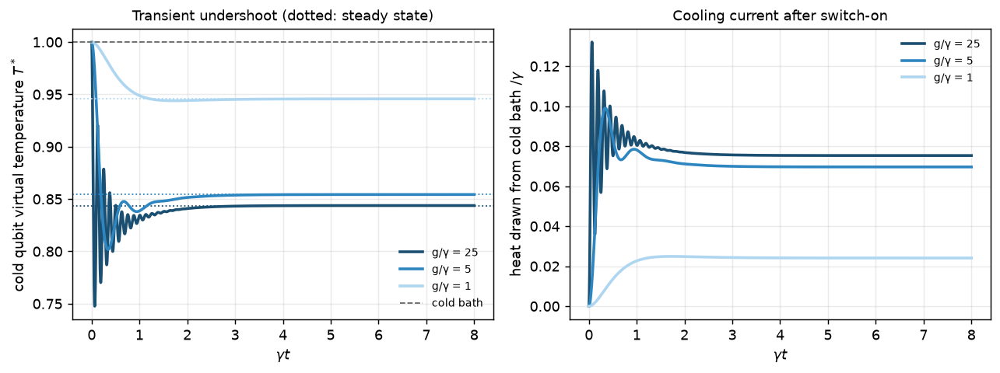

# Gallery

Every figure comes from one script in [`examples/`](../examples/README.md), and
each script prints the numbers behind its figure. They are regenerated and run
in CI.

<table>
<tr>
<td width="50%"></td>
<td width="50%"></td>
</tr>
<tr>
<td><b>When the local master equation breaks</b> (<code>examples/local_vs_global.py</code>).
Past g ≈ 0.55 the local model moves heat from cold to hot. The global model
never violates the second law, and counting boundary work repairs the local
bookkeeping but not its currents.</td>
<td><b>Beyond any classical machine</b> (<code>examples/uncertainty_relation.py</code>).
The maser's power fluctuates less than the TUR allows any classical Markov
process to at the same dissipation. The result is computed exactly, with no
sampling.</td>
</tr>
<tr>
<td width="50%"></td>
<td width="50%"></td>
</tr>
<tr>
<td><b>What weak coupling misses</b> (<code>examples/strong_coupling.py</code>).
The heat current peaks and falls, where weak-coupling theory predicts λ²
growth forever. The equilibrium state moves from Gibbs to the ultrastrong limit.</td>
<td><b>The price of forgetting</b> (<code>examples/landauer.py</code>). The excess
dissipation of erasing a bit depends on the protocol. The geodesic ramp
reaches the thermodynamic-length bound L²/τ, 65% below a linear ramp.</td>
</tr>
<tr>
<td width="50%"></td>
<td width="50%"></td>
</tr>
<tr>
<td><b>Interacting working medium</b> (<code>examples/coupled_otto.py</code>). Heisenberg
coupling lifts a two-qubit Otto engine above 1 − B_c/B_h. The finite-time
simulation (dots) matches the exact quasi-static limit (line).</td>
<td><b>Transport through a chain</b> (<code>examples/absorption_refrigerator.py</code>).
The same current crosses every bond, and virtual temperatures fall
monotonically from the hot end to the cold end.</td>
</tr>
<tr>
<td width="50%"></td>
<td width="50%"></td>
</tr>
<tr>
<td><b>Operation modes</b> (<code>examples/operation_modes.py</code>). The quasi-static
qubit Otto cycle splits exactly at ω_c/ω_h = T_c/T_h. Fast, non-commuting
ramps (quantum friction) open up accelerator and heater regions.</td>
<td><b>One cycle, not the average</b> (<code>examples/full_demo.py</code>). Sampled
quantum-jump trajectories against the exact counting-statistics distribution
(diamonds). The master-equation mean is a value no single cycle produces.</td>
</tr>
<tr>
<td colspan="2"></td>
</tr>
<tr>
<td colspan="2"><b>Inside a two-qubit engine</b> (<code>examples/multiqubit_cycle.py</code>).
A transverse-field Ising pair run as an Otto engine, site by site and stroke by
stroke. The cold bath drives the pair into an <i>entangled</i> Gibbs state
(concurrence 0.45), the fast compression ramp partly unwinds it, and the hot
bath destroys it. Fast ramps cost efficiency: 0.515 against 0.648 quasi-static.</td>
</tr>
<tr>
<td colspan="2"></td>
</tr>
<tr>
<td colspan="2"><b>Information into work</b> (<code>examples/szilard_engine.py</code>). Measure a
qubit memory, then feed back. Optimal feedback extracts exactly T·I, the
Sagawa–Ueda bound (dots on the line), even when the measurement is wrong a
given fraction of the time. In finite time it falls short by ~1/τ.</td>
</tr>
<tr>
<td colspan="2"></td>
</tr>
<tr>
<td colspan="2"><b>Optimal protocols for any drive</b> (<code>examples/optimal_protocol.py</code>).
The slow-driving friction metric for a qubit whose field grows and tilts (a
non-commuting drive). The constant-speed schedule dissipates 34% less than a
linear ramp, and full finite-time simulations (dots) land on the predictions
(dashed).</td>
</tr>
<tr>
<td colspan="2"></td>
</tr>
<tr>
<td colspan="2"><b>A quantum thermal transistor</b> (<code>examples/thermal_transistor.py</code>).
Three zz-coupled qubits (Joulain et al. 2016). At low base temperature, each
extra unit of heat into the base sends up to 4.8 units to the collector. The
same <code>examples/response</code> call returns the full conductance matrix, which is
checked for Onsager symmetry and the second law at equilibrium.</td>
</tr>
<tr>
<td colspan="2"></td>
</tr>
<tr>
<td colspan="2"><b>Colder than the steady state</b> (<code>examples/transient_cooling.py</code>).
Switch the three-qubit fridge on. With coherent internal coupling (g ≫ γ), the
cold qubit dips to T* = 0.75 before settling at 0.84. This is single-shot
cooling (Mitchison et al. 2015), and it disappears in the overdamped regime.</td>
</tr>
<tr>
<td colspan="2"></td>
</tr>
<tr>
<td colspan="2"><b>Ballistic or not</b> (<code>examples/transport_scaling.py</code>).
Boundary-driven XXZ chains up to 7 spins (128 levels, seconds each). The XX
chain's current is independent of length to 12 digits, and its interior
temperature profile is flat (ballistic). The zz term makes the current fall
roughly as 1/N and a gradient build up.</td>
</tr>
<tr>
<td colspan="2"></td>
</tr>
<tr>
<td colspan="2"><b>A periodically driven machine</b> (<code>examples/driven_machine.py</code>). A
frequency-modulated qubit with spectrally filtered baths, solved with the
Floquet–Markov master equation. It runs as an engine with η = 1 − (ω₀−Ω)/(ω₀+Ω)
and switches to a refrigerator with COP (ω₀−Ω)/2Ω exactly where predicted.
Power follows the first Bessel sideband until a higher one opens a
short-circuit channel.</td>
</tr>
<tr>
<td colspan="2"></td>
</tr>
<tr>
<td colspan="2"><b>Quantum batteries</b> (<code>examples/quantum_battery.py</code>). N cells charged
through one cavity charge faster per cell than N separate ones, with a power
advantage growing as √N (Ferraro et al. 2018; fitted exponent 0.499). The same
script splits stored work into population and coherence parts, shows the
coherent part lost to dephasing, and shows work locked in correlations or
unlocked by many-copy operations.</td>
</tr>
</table>
